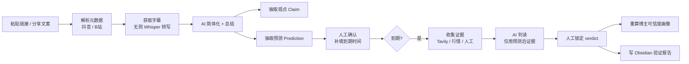

# creator-insight

**博主观点 → 预测 → 事实验证 → 可信度追踪系统**


> 本地优先的个人工具：把财经 / 科技博主视频里的"嘴上预测"，转化为**可验证、可统计、可复盘**的结构化数据；
> 到期自动收集证据、AI 判读、人工锁定，最终沉淀为博主可信度画像与 Obsidian 知识库。

---

## 这是什么

一个**本地优先、可证据溯源、按预测生命周期运转的博主可信度追踪系统**：

解析并转写博主视频 → AI 解构出「观点 Claim」与「可证伪预测 Prediction」→ 人工确认后进入到期队列 →
到期联网收集证据并 AI 判读 → 人工锁定结论 → 统计博主的**历史正确率 / 置信度校准（Brier）/ 分领域表现**，并同步写入 Obsidian。

它**不是**视频转文字工具，核心是「预测的可验证性与博主的可信度量化」。

## 核心能力

| 能力 | 说明 |
|------|------|
| 🎬 内容摄入 | 抖音 / B 站链接或分享文案，支持「仅单视频」与「该博主全部视频」两种范围 |
| 📝 转写 | 平台原生字幕优先，无字幕时本地 `faster-whisper` 兜底；AI 简体化校对 + 自动分段 |
| 🤖 AI 抽取 | 6 组任务 Prompt：简体校对 / 总结 / 观点抽取 / 预测抽取 / 时间解析 / 预测验证 |
| 🎯 预测结构化 | 主体 / 方向 / 幅度（ratio·threshold·absolute·range）/ 时间窗 / 条件 / 置信度 / 意图把握 |
| ⏰ 时间解析 | 「未来 30 天」「明年」「下季度」等相对时间 → 绝对到期时间；事件驱动型标为 fuzzy 待人工确认 |
| ✅ 验证闭环 | 到期扫描 → 证据收集（Tavily + 行情 API + 人工）→ AI 判读 → 人工锁定（五种 verdict） |
| 🔒 硬预测自动过 | AI 高置信（≥0.85）且判定确定时自动锁定，附 24 小时撤销窗口 |
| 📊 可信度画像 | 基础正确率、按领域 / 期限 / 标的 / 置信度分桶统计、Brier 校准散点、样本量门槛告警 |
| 🧠 预测抽取记忆 | 抽取时注入博主历史准确率作为上下文，校准置信度 |
| 👁 自动监控 | 关注博主 → 定时增量抓取新视频 → 审核入库 → 可选自动处理 → 推送通知 |
| 🔔 通知 | 站内 / Webhook / 邮件三通道（新视频、自动处理、自动锁定） |
| 🔑 账号与登录态 | 可见浏览器扫码登录抖音，登录态持久化 + 导出 Cookie；Cookie 四级策略，抓取自动复用 |
| 🔍 语义检索 | 本地 embedding 模型对视频与预测建索引，支持自然语言跨视频检索 |
| 📓 Obsidian | 只写验证报告 + 关键预测摘要，`frontmatter` + `AUTO/HUMAN` 双层标记防覆盖 |

## 工作流程

```
Creator → Content → Transcript → Claim → Prediction → Evidence → Verification → Creator Reliability
```



## 界面模块

前端为模块化后台（Vue3 + TDesign + ECharts），左侧导航固定、内容区独立滚动：

| 模块 | 功能 |
|------|------|
| 提交与仪表盘 | 内容摄入、实时任务进度、核心指标、创作者画像卡、校准散点 |
| 预测管理 | 待确认 / 验证队列 / 历史 / 全部预测（按视频分组，含观点明细） |
| 创作者画像 | 正确率、样本量、Brier 校准、分领域正确率、已验证预测明细 |
| 视频库 | 视频卡片（点赞/评论/转发/收藏）+ 关键词 / 语义双模式检索 |
| 语义检索 | 本地 embedding 模型选择、下载、建索引、检索 |
| 自动监控 | 关注博主、抓取间隔、暂停恢复、最近抓取记录 |
| 通知设置 | 通道配置与测试发送 |

## 快速开始

### 环境要求

- **Python** 3.10+
- **Node.js** 18+（仅构建前端时需要）
- **FFmpeg**（Whisper 转写需要，加入 PATH）
- **系统 Chrome / Edge**（抖音反爬 cookie 生成用，无需下载 playwright 自带浏览器）

### 1. 安装后端依赖

```bash
python -m venv .venv

# Windows
.venv\Scripts\activate
# macOS / Linux
source .venv/bin/activate

pip install -r requirements.txt
```

> 可选组件（`requirements.txt` 内已注释，按需启用）：
> `faster-whisper`（本地转写）、`akshare` / `yfinance`（财经行情）、
> `modelscope` + `sentence-transformers` + `torch`（本地语义检索）。

### 2. 配置

```bash
# 复制模板后填写自己的密钥
cp config/config.example.json config/config.json
```

最少需要填写 `ai.cloud.api_key`（默认对接 DeepSeek，兼容 OpenAI 协议）。
`config/config.example.json` 中每个可选项都带 `_xxx_note` 说明。

### 3. 构建前端

> ⚠️ 仓库**不含前端构建产物**（`static/vue/` 已被 `.gitignore` 忽略），首次运行前需自行构建。

```bash
npm install
npm run build      # 产物输出到 static/vue/，由 FastAPI 托管
```

### 4. 启动

```bash
# 方式一：一键脚本（Windows）
start.bat

# 方式二：手动启动
python -m uvicorn app.main:app --host 127.0.0.1 --port 8781
```

访问 **http://127.0.0.1:8781**

### 5. 环境自检（推荐）

```bash
python scripts/doctor.py
```

一键检查配置文件 / AI key / FFmpeg / faster-whisper / playwright / yt-dlp / 数据目录 / 服务可启动性。

## 项目结构

```
creator-insight/
├── app/                        # 后端（FastAPI）
│   ├── main.py                 # 入口：API 端点 + 异步任务中心 + 后台调度
│   ├── db.py                   # SQLite 建表 / 迁移（WAL）
│   ├── models.py               # Pydantic Schema
│   ├── config.py               # 配置加载（支持注释的 JSON）
│   ├── api_semantic.py         # 语义检索路由
│   ├── adapters/               # 平台适配层（只负责"拿数据"）
│   │   ├── douyin.py           #   抖音：解析 / 反爬 cookie / 目录抓取
│   │   └── bilibili.py         #   B 站：API + yt-dlp 兜底
│   ├── ai/                     # AI 层
│   │   ├── provider.py         #   AIGateway（云端 / 本地 Ollama 路由）
│   │   └── prompts.py          #   6 组任务 Prompt
│   └── services/               # 服务层（核心业务）
│       ├── pipeline.py         #   抽取管线（三段式，AI 期间不持写事务）
│       ├── verification.py     #   验证闭环 + 可信度画像（核心）
│       ├── creator_monitor.py  #   关注监控 + 增量抓取
│       ├── transcribe.py       #   Whisper 转写公共服务
│       ├── notify.py           #   通知中心
│       ├── obsidian.py         #   Obsidian 写出器
│       ├── avatar.py           #   创作者头像缓存
│       └── semantic/           #   语义检索（索引 / 检索 / embedder）
├── src/                        # 前端源码（Vue3 + TS）
│   ├── App.vue / main.ts
│   ├── api/client.ts           # 全部后端接口封装
│   ├── layouts/Layout.vue      # 固定侧栏 + 顶栏布局
│   ├── composables/            # 全局任务轮询等
│   └── pages/                  # 7 个页面模块
├── scripts/                    # 回归测试与工具
│   ├── doctor.py               #   环境诊断
│   ├── smoke_test.py           #   冒烟测试
│   ├── v02_test.py ~ v05_test.py  # 各版本回归测试
│   ├── ai_evidence_test.py     #   AI 证据链测试
│   └── ingest_demo.py          #   演示数据入库
├── docs/                       # 规格文档（20+ 份）
├── config/
│   ├── config.example.json     # 配置模板（入库）
│   └── config.json             # 真实配置（已 gitignore，不入库）
├── data/                       # 运行时数据（已 gitignore，不入库）
│   ├── creator_insight.db      #   主数据库
│   ├── media/ transcripts/     #   媒体与转写产物
│   ├── cookies/                #   抖音 cookie 缓存
│   ├── avatars/                #   头像缓存
│   └── models/                 #   本地 embedding 模型
├── requirements.txt
├── package.json / vite.config.ts
└── start.bat
```

## 技术栈

| 层 | 技术 |
|----|------|
| 后端 | Python · FastAPI · Pydantic v2 · SQLite（WAL） |
| 前端 | Vue 3 · TypeScript · TDesign Vue Next · ECharts · Vite |
| AI | DeepSeek（云端，OpenAI 兼容协议）· Ollama（本地兜底） |
| 转写 | 平台字幕 · faster-whisper（本地）· FFmpeg |
| 抓取 | httpx · yt-dlp · Playwright（cookie / 反爬） |
| 检索 | sentence-transformers 本地 embedding + 向量索引 |
| 存储 | SQLite 主存 + Markdown 视图（Obsidian） |

## 核心设计原则

1. **Adapter 只问"我能拿到什么"**——反爬 / cookie 全藏在适配器内部，不触碰 DB / AI / 验证。
2. **AI / 证据 / 验证之间只传数据不传对象**——预测以 JSON 落库，验证时从 DB 重读，保证可审计。
3. **AI 调用期间绝不持有写事务**——摄取管线拆三段，规避 `database is locked`。
4. **所有状态变更写 Event Log**——关键事件可回放。
5. **长任务「提交即返回 + 后台线程 + 前端轮询」**——避免 HTTP 超时。

## 文档索引

| 文档 | 内容 |
|------|------|
| [docs/01-product-positioning.md](docs/01-product-positioning.md) | 产品定位与核心场景 |
| [docs/02-data-model.md](docs/02-data-model.md) | 核心数据模型 |
| [docs/03-architecture.md](docs/03-architecture.md) | 系统架构 |
| [docs/04-sqlite-schema.sql](docs/04-sqlite-schema.sql) | SQLite 表设计（DDL） |
| [docs/05-prediction-schema.md](docs/05-prediction-schema.md) | Prediction Schema |
| [docs/06-evidence-schema.md](docs/06-evidence-schema.md) | Evidence Schema |
| [docs/07-verification-engine.md](docs/07-verification-engine.md) | 验证引擎 |
| [docs/08-accuracy-system.md](docs/08-accuracy-system.md) | 正确率统计系统 |
| [docs/09-obsidian-format.md](docs/09-obsidian-format.md) | Obsidian Markdown 结构 |
| [docs/17-配置与本地转写.md](docs/17-配置与本地转写.md) | 配置说明与本地转写 |
| [docs/18-语义检索与模型管理.md](docs/18-语义检索与模型管理.md) | 语义检索与模型下载 |
| [docs/19-系统详解.md](docs/19-系统详解.md) | 系统详解 |
| [docs/20-账号与登录态.md](docs/20-账号与登录态.md) | 抖音账号登录、Cookie 四种来源与脱敏规则 |
| [docs/21-系统设置.md](docs/21-系统设置.md) | 配置中心：脱敏读写、保存即生效（热重载）、AI 用量上限 |
| [docs/CHANGELOG.md](docs/CHANGELOG.md) | 完整改动记录 |
| [docs/code-wiki/](docs/code-wiki/) | 代码级 Wiki（架构 / 模块 / 前端 / API） |
| [PROJECT_STATUS.md](PROJECT_STATUS.md) | 项目状态与历史改进总结 |

## 测试

```bash
python scripts/doctor.py          # 环境自检
python scripts/smoke_test.py      # 冒烟测试
python scripts/v02_test.py        # V0.2 状态机回归
python scripts/v03_test.py        # V0.3 画像 / 自动过
python scripts/v04_test.py        # V0.4 通知 / 监控
python scripts/v05_test.py        # V0.5 异步任务 / 简体化
python scripts/ai_evidence_test.py  # AI 证据链
```

## 已知限制

| 限制 | 说明 |
|------|------|
| AI 生成证据仅对历史预测有效 | AI 知识有截止日期；知识范围外的近期预测会返回 `inconclusive` 而非编造 |
| 未配置 Tavily 时 | 验证近期预测需人工贴证据；AI 证据链仅作参考（`credibility=0.4`） |
| 自动过依赖 AI 置信度 | 仅当置信 ≥ 0.85 且判定确定时生效；置信可靠性随样本积累由校准散点评估 |
| 样本量门槛 | 已验证样本 < 30 时画像仅作参考（页面会标注告警） |

## 说明

- 本项目为**本地优先的个人项目**，未指定开源许可证。
- `config/config.json` 与 `data/` 目录**不会入库**，clone 后需自行配置与准备数据。
- 语义检索的 embedding 模型**不在仓库内**，需通过前端「语义检索」页下载或按文档手动放置。

## Roadmap

- [x] V0.1 产品定义与基础链路
- [x] V0.2 验证闭环（确认 → 到期 → 证据 → 判读 → 锁定）
- [x] V0.3 博主画像 + 硬预测自动过
- [x] V0.4 自动监控 + 通知
- [x] V0.5 异步任务 + 简体化
- [x] V0.6 互动数据 + 模块化前端
- [x] V0.7-V0.8 头像 / 语义检索 / 提示词增强 / 数据清理
- [x] V0.9-V0.10 预测分组视图 / AI 总结优先展示 / 仪表盘真实数据 / 固定导航布局
- [x] V0.11 抖音账号登录态（扫码登录 + Cookie 四级策略）+ AI 厂商可切换 + SPA 路由回退
- [x] V0.12 系统设置页（AI / 搜索 / 通知 / Obsidian / 验证参数可视化配置 + AI 用量上限）
- [ ] 更多平台（快手 / 小红书 / 视频号）
- [ ] 多模型 / 多搜索源 / 插件体系
