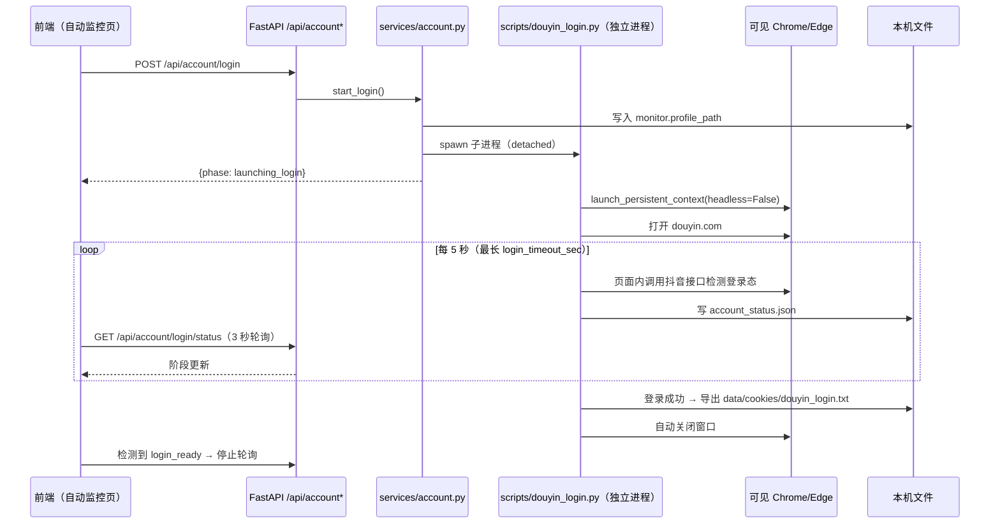

# 20 · 抖音账号与登录态

## 1. 目标

解决抖音抓取的登录态问题，替代「手工编辑 config.json + 自己在外部浏览器登录」的旧流程：

- **首次登录**：点一次按钮打开**可见**浏览器窗口，扫码登录后登录态常驻本机专用目录，之后抓取自动复用，无需重复扫码。
- **手写兜底**：没有浏览器环境时，可直接粘贴 Cookie，或指定一个已有的登录态 Chrome 目录。

登录凭据（Cookie、浏览器目录）**只保存在本机**；接口与页面均不返回 Cookie 明文与目录绝对路径。

## 2. 能力清单

| 能力 | 说明 |
| --- | --- |
| 打开登录窗口 | 可见浏览器扫码；登录成功后自动保存登录态并导出 Cookie 文件 |
| 查询登录状态 | 前端每 3 秒轮询：启动中 / 等待扫码登录 / 已登录 / 已超时 / 窗口已关闭 / 登录失败 |
| 手动写入 Cookie | 粘贴 `k1=v1; k2=v2`，写入配置并同步生成 Netscape 文件 |
| 写入浏览器目录 | 指定登录态 Chrome `user-data-dir` |
| 导出 Cookie | 从已登录目录导出 Netscape Cookie 文件（供 httpx / yt-dlp 复用） |

## 3. 登录流程



判定依据：页面上下文内调用抖音接口，未登录时返回状态码 **2483**。

## 4. Cookie 四级来源与优先级

`app/adapters/douyin.py` 的 `_ensure_cookies()` 按优先级取用：

| 顺序 | 来源 | 落点 | 说明 |
| --- | --- | --- | --- |
| ① | 手动配置 | `config.monitor.douyin_cookie` | 账号页「保存 Cookie」写入 |
| ② | **登录态文件** | `data/cookies/douyin_login.txt` | 登录成功 / 「导出 Cookie」写入，含登录身份 |
| ③ | 匿名缓存 | `data/cookies/douyin_{vid}.txt` | 无头浏览器自动生成的匿名 Cookie |
| ④ | 现场生成 | 同上 | 前三者都不可用时，playwright 现场生成 |

主页目录抓取（`fetch_creator_videos`）在 httpx 被风控时回退到 `_fetch_videos_via_browser`，使用 `monitor.profile_path` 指向的**登录态目录**（登录成功后自动写入，无需手工配置）。

## 5. 接口契约

```
GET  /api/account                      # 账号总览（脱敏）
POST /api/account                      # { profile_path } 写入浏览器目录
POST /api/account/cookie               # { cookie } 手动写入 Cookie
POST /api/account/login                # { profile_path? } 启动可见登录窗口
GET  /api/account/login/status         # 登录阶段（前端轮询）
POST /api/account/export-cookie        # 从登录目录导出 Cookie 文件
```

**GET /api/account 响应（不含明文与绝对路径）：**

```json
{
  "login": { "phase": "idle", "ready": false, "verified_at": null, "status_code": null, "error": null },
  "cookie": { "configured": true, "source": "login", "count": 42 },
  "profile": { "configured": true, "dir_name": "douyin", "exists": true }
}
```

**错误语义**：不存在 → `404`；状态冲突（Cookie 格式非法 / 目录未配置 / 登录窗口已开）→ `409`；其他 → `502`。

## 6. 脱敏规则（硬性）

- 接口**不返回** Cookie 值与浏览器目录绝对路径，`profile` 只给目录名。
- 日志只打印文件名、数量、阶段，不打印 Cookie 内容。
- 服务层统一脱敏，前端无需二次处理。

## 7. 配置项

`config/config.json`（模板见 `config.example.json`）：

```json
{
  "account": {
    "enabled": true,
    "login_timeout_sec": 900,
    "default_profile_dir": ""
  },
  "monitor": {
    "douyin_cookie": "",
    "profile_path": ""
  }
}
```

| 字段 | 说明 |
| --- | --- |
| `account.enabled` | 关闭后 `/api/account/login` 拒绝启动登录窗口 |
| `account.login_timeout_sec` | 等待扫码超时（默认 900 秒 = 15 分钟） |
| `account.default_profile_dir` | 留空使用 `data/browser_profile/douyin` |
| `monitor.profile_path` | 登录成功后自动写入，供目录抓取复用 |
| `monitor.douyin_cookie` | 手动 Cookie（优先级最高） |

## 8. 本机文件

| 文件 | 内容 | 是否入库 |
| --- | --- | --- |
| `data/account_status.json` | 登录阶段状态 | 否（`.gitignore`） |
| `data/cookies/douyin_login.txt` | 登录态 Netscape Cookie | 否 |
| `data/browser_profile/douyin/` | 专用浏览器目录（登录态） | 否 |

## 9. 常见问题

| 现象 | 原因与处理 |
| --- | --- |
| 提示「目录被占用 / 无法启动浏览器」 | 同一浏览器目录同一时间只能被一个进程使用。关闭已打开的该目录窗口，或换一个目录 |
| 状态长时间停在「等待扫码登录」 | 未在窗口内完成扫码；超时（默认 15 分钟）后自动关闭并标记「已超时」 |
| 提示「窗口已关闭」 | 扫码前手动关闭了浏览器窗口，重新点击「打开登录窗口」即可 |
| 已登录但仍被风控 | 登录态可能过期，重新登录或改用「保存 Cookie」写入新的 Cookie |
| 提示未安装 playwright | `pip install playwright`（使用系统 Chrome/Edge，无需下载自带内核） |

## 10. 相关代码

| 文件 | 职责 |
| --- | --- |
| `app/services/account.py` | 账号总览（脱敏）、Cookie 读写与 Netscape 导出、登录子进程与状态管理 |
| `scripts/douyin_login.py` | 独立登录脚本：可见浏览器 → 轮询判定 → 导出 Cookie → 写状态 |
| `app/adapters/douyin.py` | 四级 Cookie 策略；登录态目录用于主页目录抓取 |
| `app/main.py` | 6 个 `/api/account*` 端点 |
| `src/components/DouyinAccountCard.vue` | 前端账号卡片（状态徽标 / 表单 / 登录轮询） |
| `scripts/v06_test.py` | 回归测试（脱敏、双写、优先级、状态机、非法输入） |
