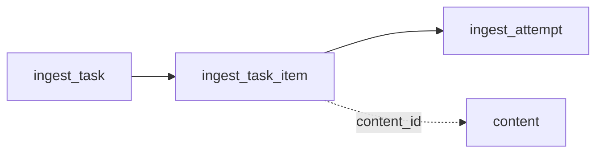

# 22 · 任务与状态契约

> 对标参考项目 `douyin-creator-distill` 的 `docs/状态管理契约.md`。
> 本契约统一 creator-insight 中「任务、尝试、单条作品处理、产物」的身份与生命周期，
> 禁止各页面自行推断状态。
>
> **文档状态：契约已落地（V0.13，2026-09-13；自动重试于 2026-09-14 补齐）。**
> 实现：`app/services/task_store.py`（状态机守卫 / 错误分类 / 汇总 / 恢复 / 过滤 / 自动重试策略）
> + `app/db.py` 三表（`ingest_task` / `ingest_task_item` / `ingest_attempt`）
> + `app/main.py` 任务流程改造与 `_process_with_auto_retry()` 执行层。
> 回归测试：`scripts/v08_test.py`（84 项）+ `scripts/auto_retry_test.py`（31 项）。
> 落地前的差距对照保留在 §8 存档。

---

## 一、目的与适用范围

### 1.1 目的

当前 ingest 任务状态保存在进程内存（`app/main.py` 的 `_INGEST_TASKS`），服务重启即丢失；批量任务中途失败后无断点、无重试、无失败明细保留。本契约的目标是：

1. 定义任务、尝试、单条作品处理、产物的**唯一身份**，使状态可持久化、可恢复；
2. 定义状态的**合法流转**与**不变量**，使失败不会污染已成功的成果；
3. 统一**统计口径**，使页面数字有唯一来源，不再由前端临时推断。

### 1.2 适用范围

| 链路 | 是否适用 | 说明 |
|------|---------|------|
| 异步 ingest（`mode=single`） | ✅ 本契约主体 | 单条视频：字幕 → 下载 → 转写 → AI 抽取 → 产物写入 |
| 异步 ingest（`mode=all`） | ✅ 本契约主体 | 批量抓取博主全部视频并逐条处理 |
| 关注监控抓取（`crawl_task`） | ✅ 适用同一套任务语义 | 由 `app/services/creator_monitor.py` 写入，当前同样无重试与恢复 |
| 预测验证链路（`prediction.status`） | ⚠️ 仅约定边界 | 状态机仍由 `app/services/verification.py` 承担，本契约只规定与之的**对齐关系**（见 §3.3） |

### 1.3 明确禁止

1. **页面不得通过截取「最近若干条任务」临时推断全局状态**——全局计数必须来自聚合查询，批次进度必须来自该批次的明细。
2. 不得在失败时静默降级或吞掉错误；失败必须落库并保留原因。
3. 不得因重试而重复写入已成功作品的产物（见不变量 #3）。

---

## 二、核心对象与唯一身份

| 对象 | 唯一身份 | 责任 |
|------|---------|------|
| **任务**（Task） | `task_id` | 一次用户提交或调度器发起的处理目标（单条 / 批量） |
| **任务明细**（Task Item） | `task_id + content_id` | 批次内单条视频的处理单元，是「单条作品状态」的载体 |
| **尝试**（Attempt） | `attempt_id` | 对某个明细的一次执行尝试，记录策略、错误分类与产物路径 |
| **产物**（Artifact） | 文件路径唯一 | 转写文案、AI 总结、Obsidian 笔记等本地文件 |
| **内容**（Content） | `content_id` | 已入库视频，跨任务复用的全局实体（本项目无 `source_key` 概念） |

> **身份说明**：本项目的作品身份即 `content_id`（由平台 + 平台视频 ID 决定），**不使用**参考项目的 `source_key + video_id` 复合键。任务与尝试均为「一次执行」的载体，不得反向改写 `content` 的身份。

---

## 三、状态取值与合法流转

### 3.1 任务状态机（扩展后）

现有取值为 `pending | running | success | error`，扩展为：

```text
queued ──> running ──> success                    （吸收态）
             │  └───> partial                   （批次部分成功）
             │  └───> failed                    （可重排重试）
             │  └───> waiting_for_action        （需人工：登录/验证码/限流/配额）
             │  └───> interrupted_recoverable   （服务中断，有断点）──> queued
             └──> pausing ──> paused ──> queued
```

| 状态 | 含义 | 是否终态 |
|------|------|---------|
| `queued` | 已创建、等待执行 | 否 |
| `running` | 正在执行 | 否 |
| `pausing` / `paused` | 安全暂停中 / 已暂停（当前作品处理完不再取下一条） | 否 |
| `waiting_for_action` | 必须由人工处理（登录失效、验证码、限流、配额） | 否（人工处理后回 `queued`） |
| `interrupted_recoverable` | 本地服务中断，但有可恢复断点 | 否（启动时回 `queued`） |
| `partial` | 批次完成但存在失败条目 | 否（可对失败项重排） |
| `success` | 全部条目成功 | **是（吸收态）** |
| `failed` | 失败且不可自动恢复 | 否（允许重新入队） |

> **迁移说明**：现有实现只有 `pending / running / success / error`。落地时 `pending → queued`、`error → failed`，其余为新增值，需在 `app/db.py` 建表后写入。

### 3.2 单条视频处理状态机

```text
not_started ──> queued ──> running ──> completed        （吸收态）
                            │  └───> failed ──> queued  （重试）
                            └───> paused ──> queued
```

单条状态在**每个阶段边界**写回（字幕 / 下载 / 转写 / AI 抽取 / 产物写入），使中断后可从明细粒度恢复，而不是只能整批重跑。

### 3.3 与预测验证状态的边界

| 概念 | 归属 | 说明 |
|------|------|------|
| 任务 / 明细 / 尝试状态 | 本契约（`docs/22`） | 描述「处理有没有跑完」 |
| `prediction.status` | `docs/07` + `app/services/verification.py` | 描述「预测处于验证生命周期的哪一步」 |

两者**不得互相替代**：一条 ingest 任务成功，不代表其抽取出的预测已通过人工确认；反之预测进入 `final` 也不影响任务状态。唯一例外是产物写出：任务成功后应写出预测对应的 Obsidian 笔记（当前由 `_process_one_video()` 承担）。

---

## 四、不变量

以下每条均为**可判定的断言**，落地时可直接写成测试用例。

1. **唯一性**：同一 `task_id` 下的 `(task_id, content_id)` 只能存在一条明细。
2. **产物不可重复写**：一条明细 `completed` 后，重试或新批次不得重复写入其产物；已存在的产物文件应复用而非覆盖。
3. **已完成不可降级**：`completed` 的明细状态不得被后续任何失败任务改写；`success` 的任务不得回退为 `failed`。
4. **汇总方向唯一**：批次状态由明细状态**汇总**得出（全成功=`success`，有失败=`partial`，全失败=`failed`），**不得反向覆盖**明细事实。
5. **口径不得混用**：批次进度必须读该任务的明细；全局计数必须读聚合（任务表/内容表）。页面不得用「最近 N 条任务」推算全局数字。
6. **失败可重入**：历史 `failed` 明细允许重新进入待处理集合；`completed` / `queued` / `running` 默认跳过。
7. **失败信息必须保留**：失败原因、尝试次数、最后任务 ID 必须落库，不得只打日志。
8. **需人工状态不得自动跨越**：`waiting_for_action` 只能由人工处理后解除，任何自动流程不得绕过（见 `docs/23` 不可绕过原则）。
9. **产物索引不写敏感信息**：产物表只存路径与元数据，**不得**写入 Cookie、API Key、浏览器 Profile 路径。
10. **幂等恢复**：服务重启的恢复动作（`running → queued`）不计入业务重试次数，且可重复执行而不改变结果。

---

## 五、吸收态与终态保护

| 对象 | 吸收态 | 保护规则 | 唯一例外 |
|------|-------|---------|---------|
| 任务 | `success` | 不得被降级 | 无 |
| 单条明细 | `completed` | 不得被降级、不得重复处理 | 用户**显式**要求重新生成产物时，创建**新任务**而非改写旧明细 |

> 该规则的实践意义：批量任务中第 7 条失败时，前 6 条的成果必须完整保留，重试只针对失败项，而不是整批重跑（整批重跑会重复消耗 AI 额度并重复写产物）。

---

## 六、待处理集合公式

每次提交任务前统一计算：

```text
待处理 = 用户选择或新增的作品
       + 历史可重试失败的作品（failed）
       - 已完成的作品（completed）
       - 正在排队或运行的作品（queued / running）
```

**空集处理**：若计算结果为空，接口必须明确返回「所选作品均已完成或正在处理中」，**不得创建空任务**。

对应到本项目：`mode=all` 的批量提交（`POST /api/ingest`）在抓取目录后、逐条处理前，必须先按上述公式过滤，当前实现**未做该过滤**（见 §8）。

---

## 七、统计口径统一

| 展示项 | 唯一数据来源 | 禁止 |
|--------|-------------|------|
| 批次进度（第 N / 共 M 条） | 该 `task_id` 的明细聚合 | 用其它任务的明细凑数 |
| 单条处理阶段 | 该明细的 `stage` | 由前端根据耗时猜测 |
| 全局「处理中任务数」 | 任务表聚合查询 | 截取内存 dict 的最近 N 条 |
| 全局「已处理视频数」 | `content` 表聚合 | 累加最近任务的 `total` |
| 失败数量 | 明细中 `failed` 计数 | 仅数日志行数 |

> **与现状的差距**：当前 `get_ingest_tasks(limit=10)` 只返回内存中的最近 10 条，前端据此展示"任务列表"；服务重启后列表清空，用户无法看到历史任务与失败原因。这就是 §1.3 禁止条款的直接来源。

---

## 八、与现状实现的差距

| # | 契约要求 | 现状 | 位置 | 差距 |
|---|---------|------|------|------|
| 1 | 任务状态持久化 | **纯内存** dict，重启即丢 | `app/main.py:142-190`（`_INGEST_TASKS` / `_update_ingest_task()` / `get_ingest_task()`） | ❌ 需建表 |
| 2 | 失败保留原因与尝试次数 | `except` 直接置 `status="error"` 后终止 | `app/main.py:270-313`（`_run_ingest_job()`） | ❌ 无重试、无错误分类、无 attempt 记录 |
| 3 | 单条粒度断点 | 批量循环内单条失败即抛错终止整批 | `app/main.py:316+`（`_run_ingest_job_all()`） | ❌ 需"单条失败只标记该条，后续继续" |
| 4 | 重启恢复 | 无任何恢复逻辑 | — | ❌ 需启动时 `running → queued` |
| 5 | 待处理集合过滤 | 直接对抓取到的全部视频逐条处理 | `app/main.py:316+` | ❌ 需按 §6 公式过滤 |
| 6 | 关注监控抓取同样适用 | `crawl_task` 表只跑一次、无重试、无恢复 | `app/db.py:200` + `app/services/creator_monitor.py:510/523` | ⚠️ 可复用同一套三表设计 |
| 7 | 统计口径统一 | 任务列表读内存最近 10 条 | `get_ingest_tasks()` | ❌ 需改聚合查询 |
| 8 | 产物索引 | 产物路径只存在于成功后的内存 `result` | `_process_one_video()` 返回的 `obsidian_files` / `saved_files` | ❌ 需落表 |

**已具备的良好基础**（无需改造）：

- 单条流程已按阶段回调（`_process_one_video()` 的 `on_stage`），阶段边界清晰，适合作为落库点；
- 已有 `crawl_task` 表作为"任务持久化"的先例；
- 已有 `event_log` 审计表可承载关键状态变更留痕。

---

## 九、表设计草案

> 本小节为**设计草案**，落地时写入 `app/db.py` 的 `SCHEMA_SQL`（`CREATE TABLE IF NOT EXISTS`）；若需给已存在的表加列，使用 `_ensure_column()`。

### 9.1 `ingest_task`（任务）

| 字段 | 类型 | 说明 |
|------|------|------|
| `id` | TEXT PK | 任务 ID（沿用现有 uuid） |
| `mode` | TEXT | `single` / `all` |
| `platform` | TEXT | `douyin` / `bilibili` |
| `raw_input` | TEXT | 原始输入（链接或分享文案） |
| `status` | TEXT | 见 §3.1 |
| `stage` / `stage_progress` / `progress` / `message` | TEXT / REAL | 与现有内存字段一致 |
| `total` / `succeeded` / `failed_count` | INTEGER | 汇总数字（由明细聚合写入） |
| `error` | TEXT | 任务级错误（如有） |
| `created_at` / `started_at` / `finished_at` | INTEGER | 时间戳 |
| `result_json` | TEXT | 兼容现有 `/api/tasks/{id}` 的 `result` 返回 |

### 9.2 `ingest_task_item`（单条明细）

| 字段 | 类型 | 说明 |
|------|------|------|
| `id` | INTEGER PK | 自增 |
| `task_id` | TEXT | 外键 → `ingest_task.id` |
| `content_id` | TEXT | 单条视频，见 §2；**处理完成后**才回填（抓取目录阶段为 `NULL`） |
| `platform_vid` | TEXT | 平台视频 ID：处理前即可确定，用于去重与待处理过滤 |
| `title` | TEXT | 冗余展示用（避免 JOIN） |
| `status` | TEXT | 见 §3.2 |
| `stage` / `stage_cn` | TEXT | 当前阶段（与现有 `items[]` 字段一致） |
| `attempt_count` | INTEGER | **执行总次数**（成功 / 失败都计），由执行层单点维护 |
| `auto_retry_count` | INTEGER | **仅自动重试**次数，用于 3 次额度判定；重启恢复与人工重试不计入（见 `docs/23` §3） |
| `error` / `error_class` | TEXT | 失败原因与分类（`retryable` / `non_retryable` / `needs_action`） |
| `updated_at` | INTEGER | 最后更新时间 |
| **唯一约束** | | `UNIQUE(task_id, platform_vid)`（不变量 #1） |

> **唯一键为何用 `platform_vid` 而非 `content_id`**：抓取博主目录时内容尚未落库
> （`content_id` 为空），若以 `content_id` 去重则无法阻止同一视频被重复登记。
> `platform_vid` 在目录阶段即可确定，是更早可用的身份。

### 9.3 `ingest_attempt`（尝试记录）

| 字段 | 类型 | 说明 |
|------|------|------|
| `id` | INTEGER PK | 自增（即 `attempt_id`） |
| `task_id` / `item_id` | TEXT / INTEGER | 关联任务与明细 |
| `strategy` | TEXT | 本次策略（如 `platform_subtitle` / `whisper_local`） |
| `status` | TEXT | `running` / `success` / `failed` |
| `error_class` | TEXT | 错误分类（与 `docs/23` 对齐） |
| `artifact_paths_json` | TEXT | 本次产出的文件路径列表（**不含敏感信息**，不变量 #9） |
| `started_at` / `finished_at` | INTEGER | 时间戳 |

### 9.4 关系与写入时机



| 时机 | 写入 |
|------|------|
| 提交任务 | `ingest_task`（`queued`）+ 过滤后的 `ingest_task_item`（`queued`） |
| 开始处理某条 | `item.status=running` + 新建 `ingest_attempt`（`running`） |
| 每条失败/成功 | 立即写回 `item`（含 `attempt_count`、`error_class`）与 `attempt` |
| 批次结束 | 按 §4 不变量 #4 汇总写 `ingest_task.status` |
| 服务启动 | `running` 的 `item` → `queued`，任务 → `queued`（不变量 #10） |

---

## 十、相关文档

| 文档 | 关系 |
|------|------|
| `docs/23-任务恢复与重试矩阵.md` | 规定各场景的重试与恢复规则（本契约的执行细则） |
| `docs/adr/0001-异步任务持久化.md` | 记录"从内存迁移到 SQLite"的决策依据 |
| `docs/14-risk-register.md` | 风险条目「任务状态丢失」「重试放大成本」指向本契约与 `docs/23` |
| `docs/07-verification-engine.md` | 预测验证状态机的归属（§3.3 边界） |
| `docs/02-data-model.md` | 数据模型总览（本契约的表草案落地后需在此登记） |
