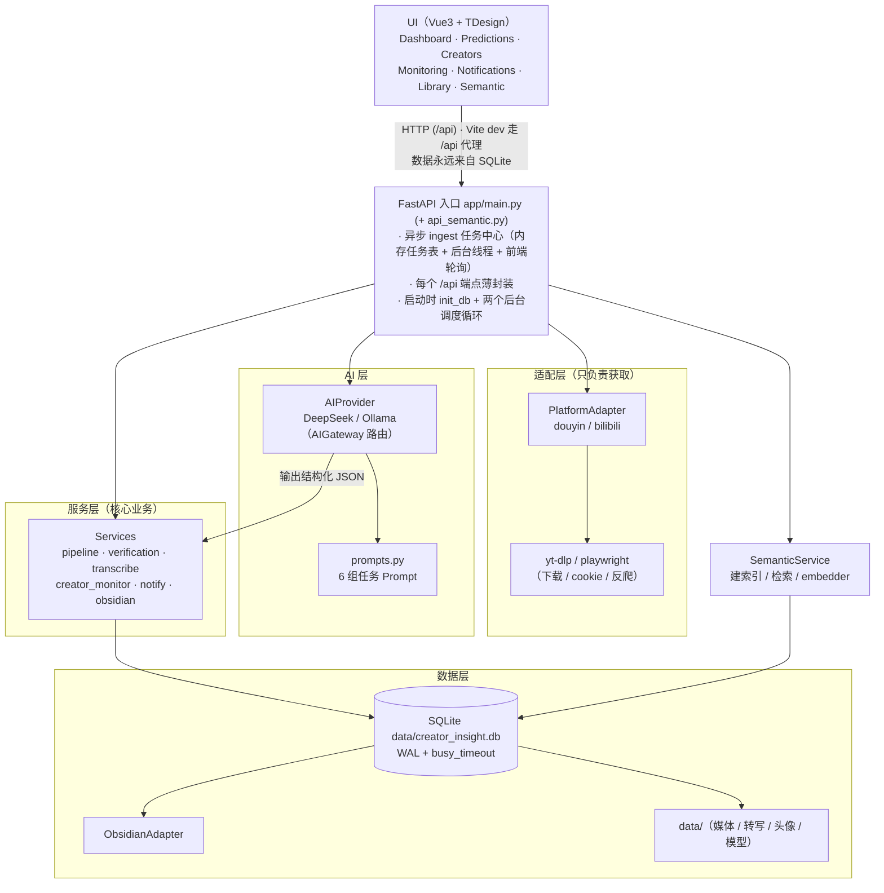
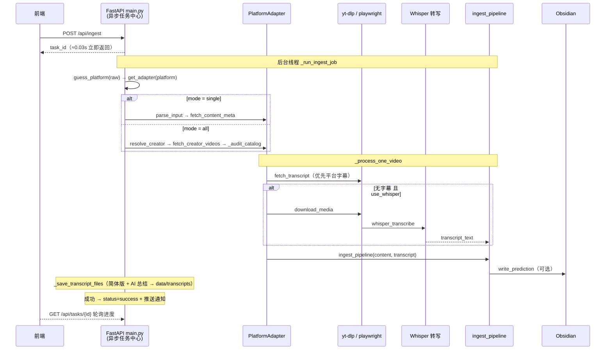
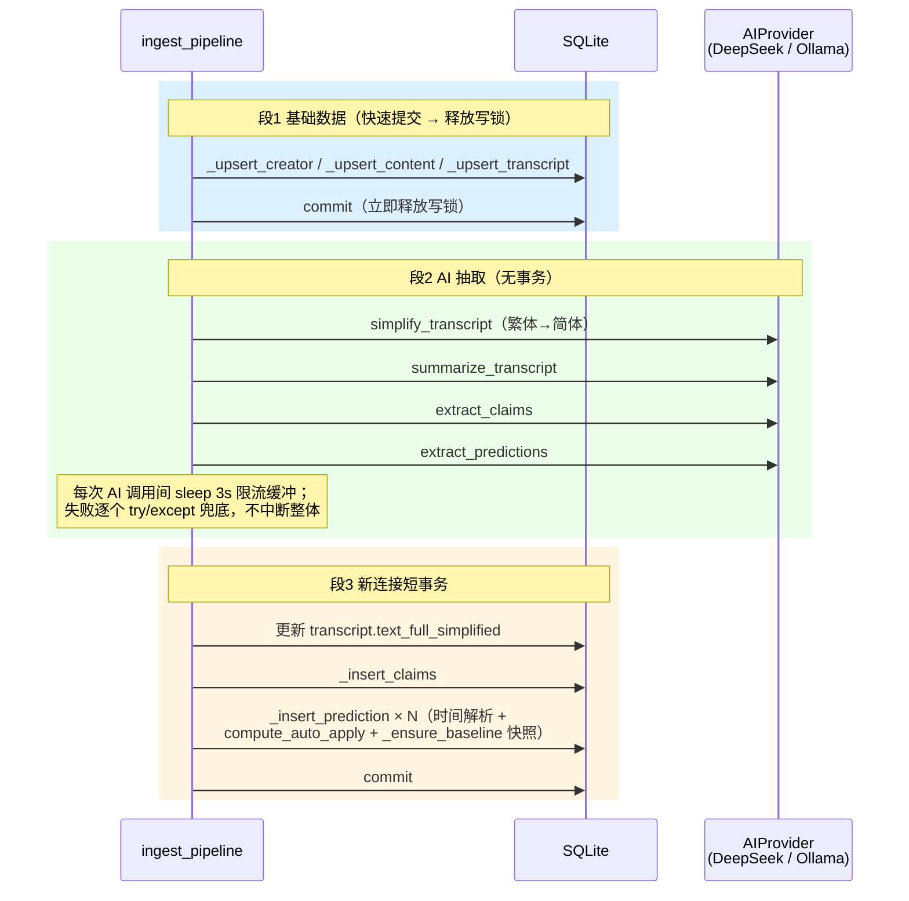
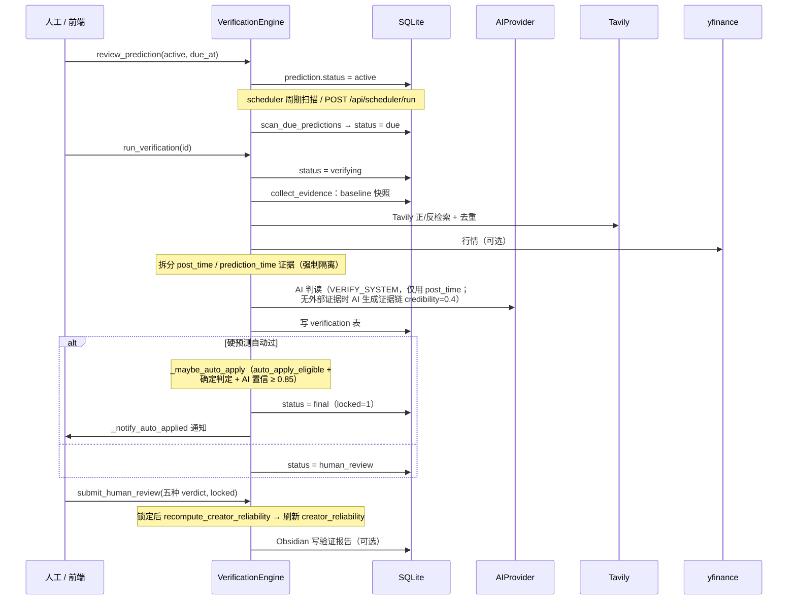
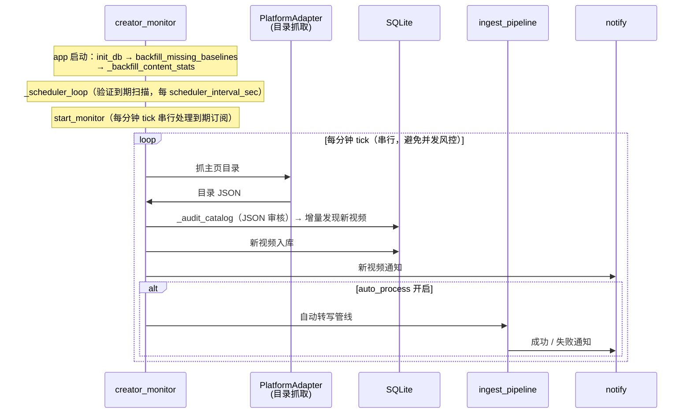
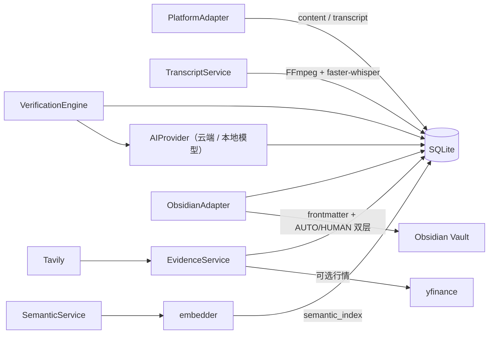

# 01 · 整体架构与数据流

## 分层架构

### Mermaid 架构总览



> 下方保留一份 ASCII 版供无法渲染 Mermaid 的编辑器使用。

```
┌──────────────────────────────────────────────────────────────────┐
│  UI（Frontend：Vue3 + TDesign）                                    │
│  Dashboard · Predictions · Creators · Monitoring ·               │
│  Notifications · Library · Semantic                              │
│  ── 只与 FastAPI /api 交互，数据永远来自 SQLite（不缓存 Markdown）   │
└──────────────────────────────┼───────────────────────────────────┘
                               │ HTTP (/api) · Vite dev 走 /api 代理
                               ▼
┌──────────────────────────────────────────────────────────────────┐
│  FastAPI 入口  app/main.py (+ app/api_semantic.py)                │
│  · 异步 ingest 任务中心（内存任务表 + 后台线程 + 前端轮询）            │
│  · 每个 /api 端点薄封装：参数 Pydantic 校验 → 调 Service → 返回 dict   │
│  · 启动时：init_db 建表/迁移、启动两个后台调度循环                    │
└───────┬───────────────┬───────────────────┬───────────────────┬───┘
        │               │                   │                   │
        ▼               ▼                   ▼                   ▼
┌───────────────┐ ┌──────────────┐ ┌─────────────────┐ ┌────────────────┐
│ PlatformAdapter│ │ AIProvider    │ │  Services 层    │ │  SemanticService│
│ douyin/bilibili│ │ DeepSeek /   │ │ pipeline│verify │ │ 建索引/搜索      │
│ 只负责"拿数据"  │ │ Ollama(AIGate│ │ transcribe│...  │ │ embedder        │
└───────┬───────┘ │ way 路由)     │ └───────┬─────────┘ └───────┬────────┘
        │         └───────┴───────┘         │                   │
        │            ▲ 其输出做结构化 JSON    │                   │
        ▼            │                      ▼                   ▼
  ┌─────────┐  ┌─────┴───────────┐  ┌──────────────────────────────┐
  │ yt-dlp  │  │ prompts.py      │  │  SQLite data/creator_insight.db│
  │playwright│ │ 6 组任务 Prompt │  │  WAL + busy_timeout           │
  └─────────┘  └─────────────────┘  └───────┬──────────────┬────────┘
                                            │              │
                                            ▼              ▼
                                     ObsidianAdapter   data/（媒体/转写/头像/模型）
```

## 设计原则（代码中的体现）

1. **Adapter 只问"我能拿到什么"**：`PlatformAdapter` 抽象只定义"获取"，反爬/cookie 全藏在实现类内部，不触碰 DB/AI/验证（见 [02-module-map.md](02-module-map.md)）。
2. **AI / 证据 / 验证之间只传数据，不传对象**：`pipeline` 产出的 Prediction 以 JSON/dict 落库；`verification` 从 DB 重新读取，再拼 JSON 给 AI，保证可审计。
3. **AI 调用期间绝不持有写事务**：`ingest_pipeline` 拆"段1 基础数据快速 commit → 段2 AI（无事务）→ 段3 新连接短事务"三段，规避 `database is locked`（[03-backend-core.md](03-backend-core.md)）。
4. **所有状态变更写 Event Log**：`log_event` 记录 `prediction/evidence/verification/content` 的关键事件，可回放（[03-backend-core.md](03-backend-core.md)）。
5. **长任务"提交即返回 + 后台线程 + 前端轮询"**：ingest 与模型下载都采用该模式，避免 HTTP 超时。

## 核心运行时时序

### 1) 内容摄入（单视频 / 博主全部）



### 2) 抽取管线（`ingest_pipeline`，三段式）



### 3) 验证闭环（`services/verification.py` 为核心）



### 4) 自动监控 + 通知（启动即运行的后台循环）



## 数据在模块间的流动方向

