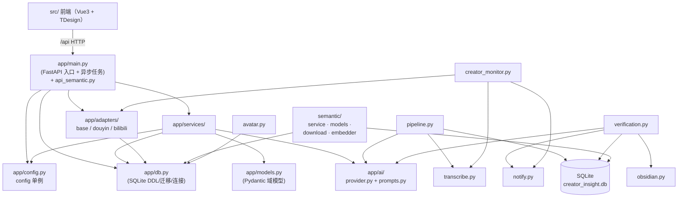

# 02 · 目录结构与模块职责

## 目录树（业务代码）

```
creator-insight/
├── app/                          # 后端 Python 包（FastAPI）
│   ├── main.py                   # FastAPI 入口：全部 /api 路由 + 异步 ingest 任务中心 + 后台调度
│   ├── api_semantic.py           # /api/semantic 语义检索管理路由（router）
│   ├── config.py                 # 配置加载（class Config + 单例 config）
│   ├── db.py                     # SQLite 建表(DDL) / 迁移 / get_conn / log_event
│   ├── models.py                 # Pydantic 领域模型（Prediction/Evidence/Verification/Reliability）
│   ├── adapters/                 # 平台适配层（只负责"获取"）
│   │   ├── base.py               # PlatformAdapter 抽象 + ParsedURL/CreatorInfo/ContentInfo/TranscriptResult + 注册表
│   │   ├── douyin.py             # 抖音：解析/下载(yt-dlp)/字幕/cookie(playwright)/目录抓取
│   │   └── bilibili.py           # B站：解析/元数据/字幕（API 412 时 yt-dlp 兜底）
│   ├── ai/                       # AI 层
│   │   ├── provider.py           # AIProvider 抽象 + DeepSeekProvider + OllamaProvider + AIGateway
│   │   └── prompts.py            # 6 组任务 System Prompt（simplify/summarize/claim/prediction/time/verify）
│   └── services/                 # 业务服务层（核心）
│       ├── pipeline.py           # 抽取管线：转写→简体→总结/观点/预测→入库 + Baseline
│       ├── verification.py       # V0.2 验证闭环 + V0.3 画像统计/硬预测自动过（核心引擎）
│       ├── transcribe.py         # 本地 Whisper 转写（FFmpeg 提音频 + 产物落盘 + 断点缓存）
│       ├── obsidian.py           # Obsidian 写出器（frontmatter + AUTO/HUMAN 双层）
│       ├── creator_monitor.py    # V0.4 关注监控：订阅/目录抓取/审计/增量/自动处理/调度
│       ├── notify.py             # V0.4 通知中心：local/Webhook/邮件 + 触发点
│       ├── avatar.py             # 创作者头像下载/缓存
│       └── semantic/             # 语义检索子包（V0.8 清理：已删除遗留 embedding.py）
│           ├── service.py        # SemanticService（设置/下载/索引/搜索编排）
│           ├── models.py         # 模型注册表（lightweight/high_precision）+ 安装状态
│           ├── download.py       # ModelScope/HuggingFace 断点续传下载
│           └── embedder.py       # sentence-transformers 本地向量化
├── src/                          # 前端（Vue3 + Vite + TS + TDesign）
│   ├── main.ts                   # 入口：createApp + TDesign 注册
│   ├── App.vue                   # 根组件：路由映射（hash-less）+ 页面分发
│   ├── layouts/Layout.vue        # 侧边栏 + 顶栏 + 通知铃铛角标
│   ├── api/client.ts             # 所有后端 API 的 fetch 封装 + TS 类型
│   └── pages/                    # 页面
│       ├── Dashboard.vue         # 提交与仪表盘
│       ├── Predictions.vue       # 预测生命周期管理
│       ├── Creators.vue          # 创作者可信度画像
│       ├── Monitoring.vue        # 自动监控管理
│       ├── Notifications.vue     # 通知设置
│       ├── Library.vue           # 视频库（互动数据 + 语义搜索）
│       └── Semantic.vue          # 语义检索设置页
├── config/
│   ├── config.example.json       # 配置模板
│   └── config.json               # 实际配置（AI key 等）
├── data/                         # 运行时数据（gitignore）
│   ├── creator_insight.db        # SQLite 主库
│   ├── media/                    # 下载的视频/音频
│   ├── avatars/                  # 头像缓存（挂载为 /avatars）
│   ├── cookies/                  # 抖音 cookie 缓存
│   ├── transcripts/              # 简体校对版/AI 总结 md + whisper 产物(md/json/srt)
│   └── models/embedding/         # 本地 embedding 模型
├── docs/                         # 产品规格(01-17) + 本 Code Wiki(code-wiki/)
├── scripts/                      # 测试与工具脚本
│   ├── smoke_test.py / v02_test.py / v03_test.py / v04_test.py / v05_test.py
│   ├── ai_evidence_test.py       # AI 生成证据链测试
│   ├── doctor.py                 # 一键环境诊断
│   ├── ingest_demo.py            # 演示数据入库
│   └── _test_*.py / _diag_pred.py
├── static/                       # FastAPI 托管的静态资源（旧 index.html + 构建产物）
├── start.bat                     # Windows 双击启动脚本
├── requirements.txt              # Python 依赖
├── package.json / vite.config.ts # 前端工程
└── README.md / PROJECT_STATUS.md # 项目概况与状态总结
```

## 模块职责一览

### Mermaid 模块依赖全景



> 下方保留 ASCII 目录树与模块职责表格。

## 模块职责一览

| 模块 | 职责 | 关键约束 / 边界 |
|------|------|----------------|
| `app/main.py` | HTTP 入口；异步 ingest 任务中心；后台调度循环启动 | 不直接写业务逻辑，只做参数校验 + 调 Service |
| `app/api_semantic.py` | 语义检索管理路由 | 只负责语义相关端点的薄封装 |
| `app/config.py` | 读取 `config/config.json`（支持 `#` 注释、深合并、`CI_` 环境变量覆盖） | 全局单例 `config` |
| `app/db.py` | SQLite DDL/迁移/连接/事件日志 | WAL + busy_timeout；`CREATE TABLE IF NOT EXISTS` + `_ensure_column` 轻量迁移 |
| `app/models.py` | Pydantic Schema（Prediction/Evidence/Verification/ReliabilityStats） | 与 `docs/05、06` 对齐 |
| `app/adapters/` | 平台解析、元数据、字幕、下载、目录抓取 | 不触碰 AI/DB；反爬内部化 |
| `app/ai/provider.py` | 云端/本地模型调用与兜底 | 所有任务返回结构化 JSON；路由由 `task_model_map` 决定 |
| `app/ai/prompts.py` | 6 组任务 Prompt | 输出强制简体中文 |
| `app/services/pipeline.py` | 抽取管线三段式入库 | AI 期间不持写锁 |
| `app/services/verification.py` | 验证闭环 + 可信度画像 + 硬预测自动过 | 只用 post-time 证据；状态机严格 |
| `app/services/transcribe.py` | 本地 Whisper 转写 + 产物落盘 + 缓存 | 断点续转（同一媒体命中缓存秒回） |
| `app/services/obsidian.py` | 写 Obsidian：verification/prediction | frontmatter + AUTO/HUMAN 双层防覆盖 |
| `app/services/creator_monitor.py` | 订阅管理 + 目录抓取 + 审计 + 增量 + 自动处理 + 调度 | 串行处理避免并发风控 |
| `app/services/notify.py` | 通知分发（local/webhook/email） | 单通道失败不影响其他 |
| `app/services/semantic/*` | 模型管理、下载、建索引、检索 | 向量存 `semantic_index`，点积即余弦 |
| `src/` | 前端 UI | 只读实时数据；TDesign 组件 |

## 关键设计决策的代码位置

| 决策 | 代码位置 |
|------|----------|
| 异步 ingest（防长视频超时） | `app/main.py` `_INGEST_TASKS` / `_run_ingest_job` / `_process_one_video` |
| 抽取三段式（防 database is locked） | `app/services/pipeline.py` `ingest_pipeline` |
| 抖音三级 cookie（手动/缓存/playwright） | `app/adapters/douyin.py` `_ensure_cookies` / `_auto_cookie` |
| 验证时间隔离（post-time 才判定） | `app/services/verification.py` `run_verification` |
| AI 生成证据兜底（无 Tavily 也能验证） | `app/services/verification.py` `run_verification`（`ai_generated_evidence`） |
| 硬预测自动过 + 24h 撤销 | `app/services/verification.py` `_maybe_auto_apply` / `undo_auto_apply` |
| 博主可信度画像（分桶/Brier） | `app/services/verification.py` `recompute_creator_reliability` / `get_creator_profile` |
| 订阅监控 + 目录浏览器抓取 | `app/services/creator_monitor.py` + `app/adapters/douyin.py` `_fetch_videos_via_browser` |
| 语义检索 | `app/services/semantic/service.py` `index_contents` / `search` |