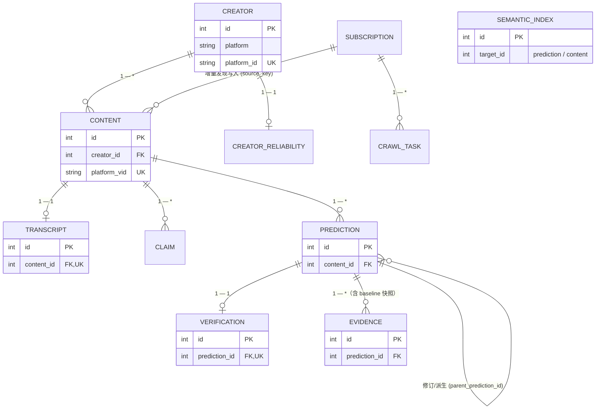
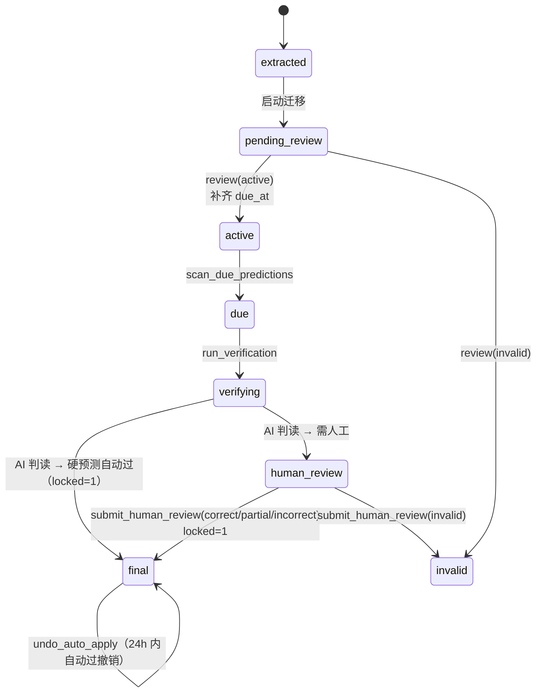

# 06 · 数据模型（SQLite）

主库：`data/creator_insight.db`（WAL 模式）。DDL 定义于 [app/db.py](../../app/db.py) `SCHEMA_SQL`。

## 表清单（13 张）

| # | 表 | 用途 | 关键列 |
|---|----|------|--------|
| 1 | `creator` | 博主 | `platform/platform_id(唯一)`, `name`, `url`, `avatar_url/avatar_path/avatar_src`, `domain_tags`, `added_at` |
| 2 | `content` | 视频 | `creator_id→creator`, `platform_vid(唯一)`, `title`, `url`, `published_at`, `duration_sec`, `fetched_at`, `raw_meta_json`, 互动四列 `digg_count/comment_count/share_count/collect_count` |
| 3 | `transcript` | 转写文本 | `content_id(唯一)→content`, `source`, `language`, `text_full`, `text_full_simplified`, `segments_json`, `created_at` |
| 4 | `claim` | 观点 | `content_id→content`, `text`, `speaker`, `start/end_offset`, `category`, `created_at` |
| 5 | `prediction` | 预测 | `content_id→content`, `parent_prediction_id→prediction`(修订), `revision_no`, `raw_text`, `interpreted_intent`, `intent_confidence`, `direction_source`, `subject/`(JSON)`, `direction`, `magnitude`(JSON), `time_expression_raw`, `time_window`(JSON), `conditions`, `confidence_raw/score`, `status`, `prediction_at`, `due_at`, `auto_apply_eligible`, `prediction_baseline_evidence_id→evidence` |
| 6 | `evidence` | 证据 | `prediction_id?`, `content_id?`, `source`(tavily/yfinance/manual/baseline_snapshot/ai_knowledge), `source_type`, `url`, `title`, `publisher`, `published_at`, `collected_at`, `is_official/is_direct`, `credibility`, `summary`, `raw_json`, `relation`(baseline/primary/contradicting/corroborating/context), `collection_batch` |
| 7 | `verification` | 验证记录 | `prediction_id(唯一)→prediction`, `ai_verdict/ai_score/ai_confidence/ai_reasoning_json/ai_evidence_ids/ai_judged_at`, `human_verdict/human_score/human_notes/human_reviewed_at`, `final_verdict`, `locked`, `auto_applied_at` |
| 8 | `creator_reliability` | 博主画像缓存 | `creator_id(唯一)→creator`, `computed_at`, 计数统计, `base_accuracy`, 各分桶 JSON, `calibration_score` |
| 9 | `event_log` | 事件审计 | `entity_type/entity_id`, `event_type`, `payload`, `actor`, `created_at` |
| 10 | `subscription` | 关注规则 | `platform/source_key(唯一,sec_user_id)`, `source`, `display_name`, `enabled`, `check_interval_hours`, `auto_process`, `last_checked/success_at`, `next_check_at`, `last_error/result_json`, `baseline_video_ids_json`, `deleted_at`(软删) |
| 11 | `crawl_task` | 抓取任务记录 | `subscription_id→subscription`, `trigger`(manual/schedule), `status`, `total_videos`, `new_video_ids_json`, `error`, `started/finished/created_at` |
| 12 | `notification` | 通知记录 | `channel`(local/webhook/email), `category`, `title`, `body`, `payload_json`, `status`(sent/failed), `error`, `created_at`, `read_at` |
| 13 | `semantic_index` | 语义向量索引 | `target_type`(prediction/content), `target_id`, `model_id`, `dimension`, `vector`(BLOB float32 小端), `text`, `created_at` |

> 多张表带索引：`prediction(status/due_at/content_id)`、`evidence(prediction_id)`、`event_log(entity)`、`subscription(next_check_at)`、`crawl_task(sub)`、`notification(created_at/read_at)`、`semantic_index(target/model)`、`content(creator)`。

## 实体关系（ER）



> `PREDICTION` / `CONTENT` → `SEMANTIC_INDEX` 为弱关联（`target_id`，非强外键）。下方保留 ASCII 版。

```
creator 1 ──── * content 1 ── 1 transcript
              * content 1 ── * claim
              * content 1 ── * prediction
prediction 1 ── 1 verification
prediction 1 ── * evidence        （含 baseline 快照）
prediction ──(parent_prediction_id)── 1 prediction  修订/派生
content 的 creator_id + prediction 关联 content → 博主视图
subscription 1 ── * crawl_task
subscription 1 ── * content（增量发现写入，由 source_key 关联）
creator 1 ── 1 creator_reliability
prediction/content → semantic_index（target_id，非强外键）
```

## 预测状态机



> 历史保留状态：`ai_verified / uncertain`。

```
extracted ──(启动迁移)──▶ pending_review
pending_review ──review(active)──▶ active     （补齐 due_at）
pending_review ──review(invalid)──▶ invalid
active ──scan_due_predictions──▶ due
due ──run_verification──▶ verifying ──(AI 判读)──▶ final  (硬预测自动过，locked=1)
                                              └─▶ human_review
human_review ──submit_human_review(correct/partial/incorrect)──▶ final (locked=1)
human_review ──submit_human_review(invalid)──▶ invalid
(自动过) final ⇠──undo_auto_apply(24h 内)── temp
其他相关状态：ai_verified / uncertain（历史保留）
```

## 关键状态/枚举值

- `PredictionStatus`（models.py）：`extracted / pending_review / active / due / verifying / ai_verified / human_review / final / invalid / uncertain`。
- `Verdict`：`correct / partial / incorrect / inconclusive / invalid`。
- `evidence.source`：`baseline_snapshot / tavily / yfinance / manual / ai_knowledge`。
- `evidence.relation`：`baseline / primary / contradicting / corroborating / context`。
- `notification.category`：`new_videos / auto_process / auto_applied / manual`。
- `crawl_task.trigger`：`manual / schedule`。